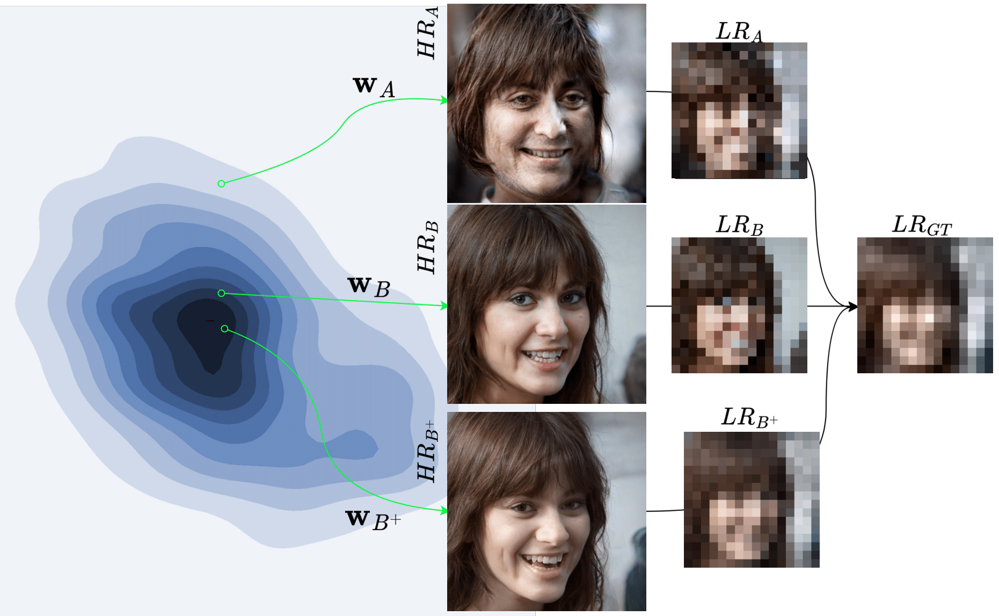

# Super-Resolution via Regularized Latent Search (RLS & RLS+)

This repository contains implementations of two super-resolution methods based on StyleGAN inversion. Both methods aim to reconstruct high-resolution (HR) images from low-resolution (LR) inputs by searching the latent space of a pretrained StyleGAN generator. The two approaches differ in how they constrain and refine the latent code:

- **RLS (Regularized Latent Search)**  
  Implements the approach from [RLS]( https://sslneurips22.github.io/paper_pdfs/paper_13.pdf). The core idea is to perform a latent search in StyleGAN’s intermediate latent space (W+) while using a normalizing flow model to “gaussianize” the latent distribution. This regularization ensures that the search remains within the dense, realistic regions of the latent space. In this way, the inverted latent code is more likely to lie on the original image manifold, leading to realistic outputs even for out-of-domain inputs.

- **RLS+ (RLS Plus)**  
  Implements the approach from [RLS+](https://arxiv.org/pdf/2311.16923). RLS+ builds on RLS by taking the latent code obtained from the initial regularized search as an **anchor point**. In a subsequent optimization stage, the method jointly fine-tunes the latent code, the noise inputs, and the generator’s weights within a small ℓ1-norm ball centered around this anchor. This further refinement allows the generator to expand its expressive range while remaining faithful to the image prior, thus striking an improved balance between reconstruction fidelity and realism.



 <!-- ## Repository Structure

- **rls.py**  
  Contains the implementation of the original Regularized Latent Search (RLS) method. It leverages a pretrained StyleGAN generator along with a normalizing flow model to constrain the latent code search.

- **rls_plus.py**  
  Contains the implementation of RLS+, which takes the latent code computed by RLS as an anchor (saved separately) and further optimizes the latent code, noise inputs, and generator parameters.

- **rls_utils.py (and/or utils.py)**  
  Shared utility functions for both implementations. These modules include functions to set seeds, load the generator, create noise tensors, perform latent projection (onto an ℓ1-ball), and other helper routines common to both methods. --> 

## How to Use

### Requirements
- Pretrained StyleGAN weights and normalizing flow checkpoints

### Running RLS

To run the RLS implementation, use the command line. For example:

```bash
python rls.py --ckpt path/to/stylegan_checkpoint.pt --input_dir path/to/lr_images --out_dir results/rls --nf_path path/to/flow_checkpoint --nf_stat path/to/flow_stats.pkl --factor 16 --steps 500 --lr 0.5
```

This command will search for the best latent code (using the RLS method) for each input LR image and save the reconstructed HR outputs into the specified output directory.

### Running RLS+

RLS+ requires an anchor latent code generated from RLS. Once you have saved the anchor latent codes (using RLS), you can fine-tune the generator, noise inputs, and latent code by running:

```bash
python rls_plus.py --ckpt path/to/stylegan_checkpoint.pt --input_dir path/to/lr_images --out_dir results/rls_plus --anchor_path path/to/saved_anchors --factor 16 --steps 50 --lr 0.0001 --num_trainable_noise_layers 9
```

This stage refines the reconstruction by locally optimizing around the anchor point within an ℓ1-norm ball constraint.

<!-- ## Experimental Setup

- **Datasets:**  
  The implementations have been tested on face datasets such as CelebA-HQ and FFHQ. The LR images are generated using bicubic downsampling with specified factors (e.g., 16×).

- **Optimization:**  
  Both methods use Adam-based optimization with a custom learning rate scheduler. RLS runs for a larger number of iterations (e.g., 500) while RLS+ runs for a shorter fine-tuning stage (e.g., 50 iterations).

- **Regularization:**  
  RLS leverages a normalizing flow to enforce a standard Gaussian latent distribution and uses additional losses (e.g., p-norm and optional cross regularization). RLS+ further constrains the optimization with an ℓ1-norm ball around the anchor latent code.
-->


## Citations
<!-- Gheisari, Marzieh, and Auguste Genovesio. "Super-Resolution through StyleGAN Regularized Latent Search." 36th Conference on Neural Information Processing Systems (NeurIPS 2022). NeurIPS-Self-Supervised Learning-Theory and Practice. 2022. -->
<!-- Gheisari, Marzieh, and Auguste Genovesio. "Super-Resolution through StyleGAN Regularized Latent Search: A Realism-Fidelity Trade-off." arXiv preprint arXiv:2311.16923 (2023). -->

```bibtex
@article{gheisari2022rls,
  title={Super-Resolution through StyleGAN Regularized Latent Search},
  author={Gheisari, Marzieh and Genovesio, Auguste},
  journal={36th Conference on Neural Information Processing Systems (NeurIPS 2022). NeurIPS-Self-Supervised Learning-Theory and Practice},
  year={2022}
}
@article{gheisari2023rls+,
  title={Super-Resolution through StyleGAN Regularized Latent Search: A Realism-Fidelity Trade-off},
  author={Gheisari, Marzieh and Genovesio, Auguste},
  journal={arXiv preprint arXiv:2311.16923},
  year={2023}
}
